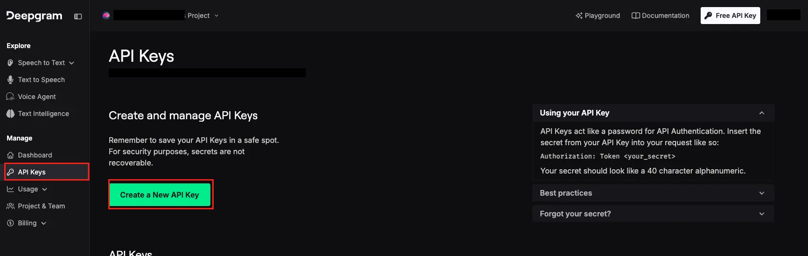
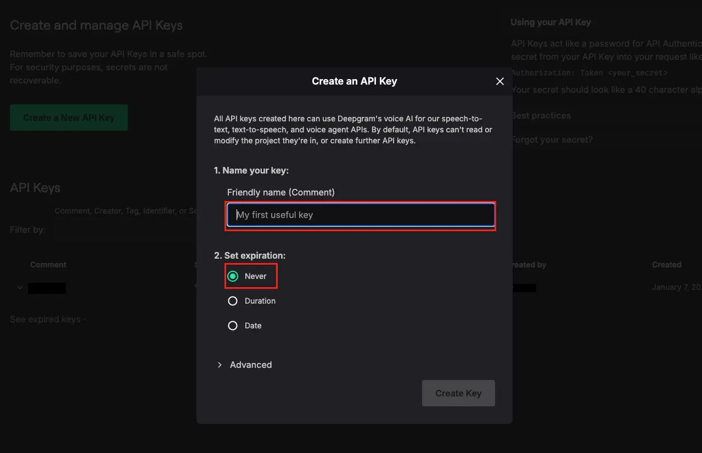
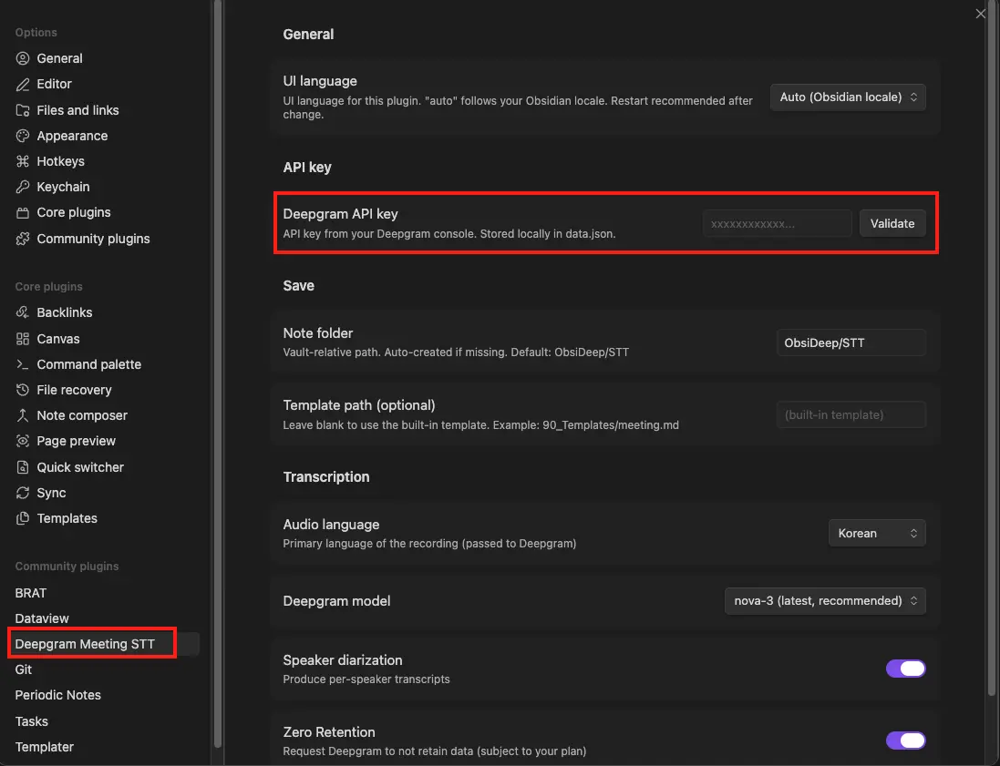
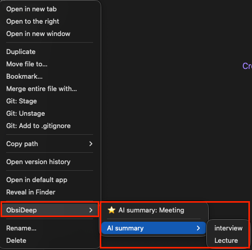
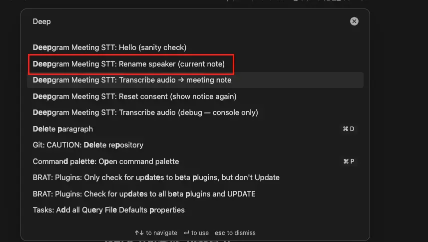

# Deepgram Meeting STT

An Obsidian plugin that transcribes meeting recordings with the [Deepgram](https://deepgram.com) speech-to-text API and saves them as markdown notes with per-speaker timestamps.

> 🇰🇷 한국어 가이드: [README-ko.md](README-ko.md)

---

## Features

- **Right-click → transcribe**: pick any audio file from the vault sidebar (or run the command palette) and the transcription lands in a new markdown note
- **Per-speaker diarization** with `[HH:MM:SS]` segment timestamps
- **Optional custom templates** with token substitution
- **Bilingual UI** (Korean / English / auto-follow Obsidian locale)
- **Zero Retention by default** — Deepgram discards audio + transcripts after processing (plan-dependent)
- **Auto-managed workspace**: creates `ObsiDeep/` (Audio/, STT/) at the vault root and writes vault `.gitignore` rules so recordings and your API key stay out of vault git sync
- **Mobile compatible** — works on Obsidian for iOS / Android

## Install

### Obsidian Community Plugins (recommended)

1. **Settings → Community plugins → Browse**
2. Search for **"Deepgram Meeting STT"**
3. Install + Enable

### BRAT (beta releases)

1. Install the [BRAT](https://github.com/TfTHacker/obsidian42-brat) plugin
2. BRAT settings → **Add Beta Plugin** → `Moonjuun/obsidian-deepgram-stt`
3. Enable the plugin in Community plugins

## Setup

On first enable, the plugin shows a one-time consent modal explaining what is sent to Deepgram. After consent it:

- Creates `ObsiDeep/` (with `Audio/` and `STT/` subfolders) at your vault root
- Adds two protection rules to your vault's `.gitignore` (one for `data.json`, one for `ObsiDeep/`)
- Writes `ObsiDeep/README.md` and `ObsiDeep/FEATURES.md` with localized usage guides

Then get a Deepgram API key:

1. Sign up at [Deepgram Console](https://console.deepgram.com) — free tier includes a **$200 credit** (~770 hours of `nova-3` transcription)



2. Dashboard → **API Keys → Create New API Key** (any name, `Member` permission is enough)



3. Paste the key into **Settings → Deepgram Meeting STT → "Deepgram API key"**
4. Click **Validate** — you should see `✓ API key is valid`



## Usage

### Drop a recording and transcribe

1. Place an audio file (`mp3`, `m4a`, `mp4`, `wav`, `flac`, `ogg`, `opus`, `webm`, `aac`) into `ObsiDeep/Audio/` (drag into the Obsidian window, or copy via Finder/Explorer)
2. **Right-click** the file in Obsidian's left sidebar → **"Transcribe with Deepgram"**
3. Enter a title → Enter
4. After ~1–2 minutes the transcribed note appears in `ObsiDeep/STT/` and opens automatically



The same flow is available from the command palette (`Cmd+P` / `Ctrl+P`) → **"Transcribe audio → meeting note"**.

> If you copied the file via Finder/Explorer and it doesn't appear in the sidebar right away, run `Cmd+P` → **"Reload app without saving"** first.

### Output

```markdown
---
date: 2026-05-13
type: meeting
tags: [meeting, stt]
duration: 28m 41s
language: ko
source: [[ObsiDeep/Audio/standup.m4a]]
speakers: ["화자 0", "화자 1"]
---

# Stand-up 2026-05-13

**화자 0** [00:00:01 - 00:00:08]
Good morning, let's start with the status updates.

**화자 1** [00:00:09 - 00:00:14]
Sure, I'll go first.
```

### Rename speakers

Speakers are labelled `화자 0`, `화자 1` by default. To replace with real names:

1. Open the meeting note
2. Command palette → **"Rename speaker (current note)"**



3. Pick the speaker from the dropdown (auto-detected from the note's frontmatter)
4. Type the real name → click **Replace**

Every occurrence in both the body and the `speakers` frontmatter array is rewritten.

## Settings

| Setting | Description | Default |
|---|---|---|
| UI language | Plugin UI (Korean / English / auto-follow Obsidian) | `auto` |
| Deepgram API key | Stored locally in `data.json` | (none) |
| Note folder | Vault-relative output path | `ObsiDeep/STT` |
| Template path | Optional custom template file | (built-in template) |
| Audio language | Primary recording language | `ko` |
| Deepgram model | `nova-3` (latest) / `nova-2` (stable) | `nova-3` |
| Speaker diarization | Produce per-speaker transcripts | `true` |
| Zero Retention | Ask Deepgram to discard data after processing | `true` |

See [FEATURES.md](FEATURES.md) for the full template token reference, accuracy guide (audio quality, speaker count, recording-room checklist), mobile usage notes, and update check.

## Security & Privacy

- Audio is sent to Deepgram over HTTPS for processing.
- Your API key is stored locally as plain JSON in `.obsidian/plugins/deepgram-meeting-stt/data.json` (Obsidian plugin standard). The plugin auto-adds this path to your vault's `.gitignore`.
- The `ObsiDeep/` folder is also auto-added to `.gitignore` so recordings and notes never enter vault git sync.
- Deepgram complies with **GDPR / SOC 2 Type II / HIPAA (with BAA) / CCPA**. See [Deepgram Trust Center](https://trust.deepgram.com) and [Privacy Policy](https://deepgram.com/privacy).
- **Zero Retention** is on by default. Guaranteed immediate effect on Growth or higher Deepgram plans; free / Pay-as-you-go tier may still retain data per standard policy (~30 days).
- Please obtain consent from meeting participants before recording and transmitting audio to a third-party API.

## Cost

Approximate cost with `nova-3`:

| Length | Cost (USD) |
|---|---|
| 30 min | $0.13 |
| 1 hour | $0.26 |
| 2 hours | $0.52 |

The free $200 signup credit covers many hours. See [Deepgram Pricing](https://deepgram.com/pricing) for current rates.

## License

[MIT](LICENSE) © 2026 Moonjuun
